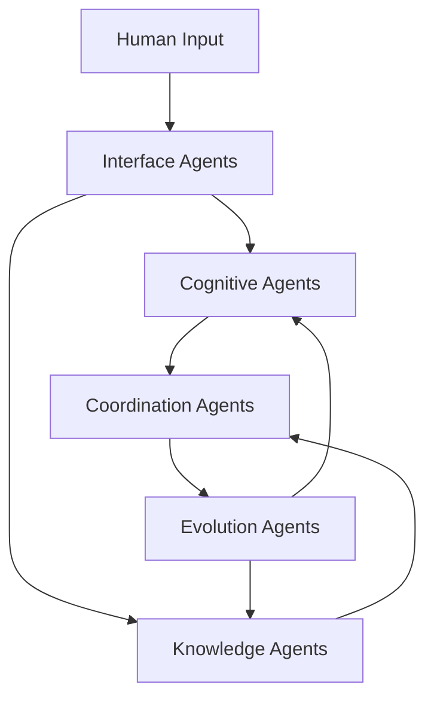

# MeshX: Autonomous Agent Mesh Network

## Vision
MeshX is the world's first autonomous agent mesh network, where intelligent agents form dynamic, self-organizing networks to amplify human capabilities. Our platform enables unprecedented cognitive enhancement through interconnected agent swarms that learn, adapt, and evolve together.

## Core Philosophy
We believe in the power of emergent intelligence through agent collaboration. MeshX creates a living network of specialized agents that work together, share knowledge, and evolve collectively to enhance human potential.

---

## Technical Architecture

### Agent Mesh Network
The foundation of MeshX is its revolutionary agent mesh architecture:

1. **Agent Types**
   - Cognitive Agents (pattern recognition, decision support)
   - Knowledge Agents (information synthesis, research)
   - Interface Agents (human interaction, feedback processing)
   - Coordination Agents (task distribution, resource management)
   - Evolution Agents (capability improvement, adaptation)

2. **Mesh Topology**
   - Dynamic agent connections based on task requirements
   - Self-healing network structure
   - Adaptive resource allocation
   - Emergent behavior optimization

3. **Agent Communication Protocol**
   - Peer-to-peer knowledge sharing
   - Real-time capability discovery
   - Experience propagation
   - Collective learning synchronization

4. **Mesh Intelligence Layer**
   - Swarm decision making
   - Collective knowledge base
   - Distributed problem solving
   - Emergent strategy formation

### Core Components

### Agent Interaction Flow
1. Interface agents process human input and requirements
2. Coordination agents form optimal agent teams
3. Cognitive and knowledge agents collaborate on solutions
4. Evolution agents optimize agent capabilities
5. Results flow back through interface agents

### Security and Privacy
- Agent-level encryption
- Secure mesh communication
- Private agent coalitions
- Authenticated agent interactions

---

## Enhancement Capabilities

### Collective Intelligence
The mesh network enables:

#### Knowledge Synthesis
- Cross-agent learning
- Distributed memory systems
- Collective experience pooling
- Dynamic knowledge graphs

#### Swarm Cognition
- Multi-agent problem solving
- Emergent pattern recognition
- Collective decision making
- Distributed reasoning

#### Adaptive Enhancement
- Real-time capability evolution
- Agent specialization
- Performance optimization
- Skill transfer between agents

### Agent Specializations

#### Research Agents
- Literature analysis
- Data synthesis
- Hypothesis generation
- Experimental design

#### Strategy Agents
- Option exploration
- Impact assessment
- Resource optimization
- Risk analysis

#### Innovation Agents
- Pattern discovery
- Trend analysis
- Opportunity identification
- Solution generation

---

## Use Cases

### Enterprise Mesh Networks

#### Research & Development
- Agent swarms for discovery
- Parallel hypothesis testing
- Automated experimentation
- Cross-domain innovation

#### Strategic Planning
- Multi-agent scenario analysis
- Distributed decision support
- Resource allocation optimization
- Risk assessment swarms

#### Innovation Management
- Idea generation networks
- Trend analysis swarms
- Market opportunity detection
- Implementation planning

### Personal Agent Networks

#### Learning Enhancement
- Personal tutor agent swarms
- Knowledge acquisition optimization
- Skill development acceleration
- Progress monitoring agents

#### Productivity Amplification
- Task optimization agents
- Focus enhancement swarms
- Time management networks
- Energy optimization agents

#### Decision Support
- Analysis agent teams
- Prediction swarms
- Strategy optimization networks
- Risk assessment agents

---

## Marketing Narrative

### Brand Story
MeshX represents the next evolution in artificial intelligence - not through singular powerful AIs, but through vast networks of specialized agents working in harmony to enhance human capabilities.

### Value Proposition
- Harness the power of agent swarm intelligence
- Create evolving, self-improving agent networks
- Enable emergent problem-solving capabilities
- Scale intelligence through agent collaboration

### Target Audience
1. **Primary**
   - Enterprise AI departments
   - Research institutions
   - Innovation labs
   - Technology companies

2. **Secondary**
   - Individual developers
   - AI researchers
   - Professional knowledge workers
   - Creative technologists

### Go-to-Market Strategy
1. **Phase 1: Network Foundation**
   - Core agent types release
   - Mesh protocol documentation
   - Early adopter program
   - Basic agent marketplace

2. **Phase 2: Mesh Expansion**
   - Advanced agent types
   - Custom agent creation tools
   - Enterprise mesh solutions
   - Agent evolution tracking

3. **Phase 3: Ecosystem Growth**
   - Agent marketplace expansion
   - Cross-organization meshes
   - Advanced evolution features
   - Industry-specific agents

### Competitive Analysis

| Feature | MeshX | Traditional AI | Agent Frameworks |
|---------|-------|----------------|------------------|
| Agent Mesh Network | ✓ | ✗ | ∼ |
| Collective Evolution | ✓ | ✗ | ✗ |
| Emergent Intelligence | ✓ | ∼ | ∼ |
| Dynamic Scaling | ✓ | ✗ | ∼ |
| Self-Improvement | ✓ | ✗ | ∼ |

---

## Future Roadmap

### Q1 2025
- Core agent types release
- Basic mesh protocol
- Agent marketplace beta

### Q2 2025
- Advanced agent creation tools
- Enhanced mesh capabilities
- Enterprise features

### Q3 2025
- Cross-mesh communication
- Advanced evolution features
- Industry solutions

### Q4 2025
- Global mesh scaling
- Advanced agent types
- Ecosystem expansion
